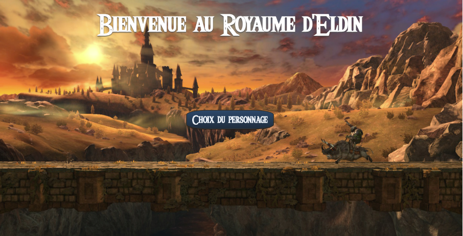

# Breath of the wild

   
 

Ce projet vous plongera dans le **Royaume d'Eldin** où vous pourrez choisir un personnage afin de vous lancer dans une chasse aux monstres. Vous affronterez une liste de monstres que vous devrez vaincre ou qui vous vaincront... Si vous parvenez à combattre tous les monstres, vous ressortiez en héros du royaume. Le nombre de monstres battus vous sera indiqué à la fin de chaque partie.

## Pour commencer

Voici quelques instructions afin de bien lancer le projet : 

### Pré-requis

Vous devez posséder :

- Un navigateur (_exemple_ : [Google Chrome](https://www.google.fr))
- Un IDE (_exemple_ : [Eclipse](https://www.eclipse.org))

### Installation

Assurez-vous de mettre le projet Maven ``Projet_Zelda`` dans votre espace de travail avant de l'importer dans votre IDE. 

## Démarrage

Exécutez dans votre IDE ``SpringLauncher.java``. 

Lancer votre navigateur et taper l'URL suivant :  http://localhost:8080/. Vous devrez arriver sur la page d'accueil du jeu. Pour commencer, cliquer sur le bouton **"Choix du personnage"**.

!

## Fabriqué avec

* [Eclipse](https://www.eclipse.org) - Environnement de développement
* [Postman](https://www.postman.com) - Environnement de développement d'API
* [Materialize.css](http://materializecss.com) - Framework CSS (front-end) : par problème de conflit que nous n'avons pas su régler, nous avons intégré à notre CSS uniquement les parties qui nous intéressaient
* JSON (JavaScript Object Notation) - Format d'échange de données en texte lisible

## Versions

**Dernière version :** 5.2

## Auteurs

* **Louanne Thevenoux** _alias_ [@tite-lou](https://github.com/tite-lou)
* **Coline Feliciano** _alias_ [@brocoline](https://github.com/brocoline)

